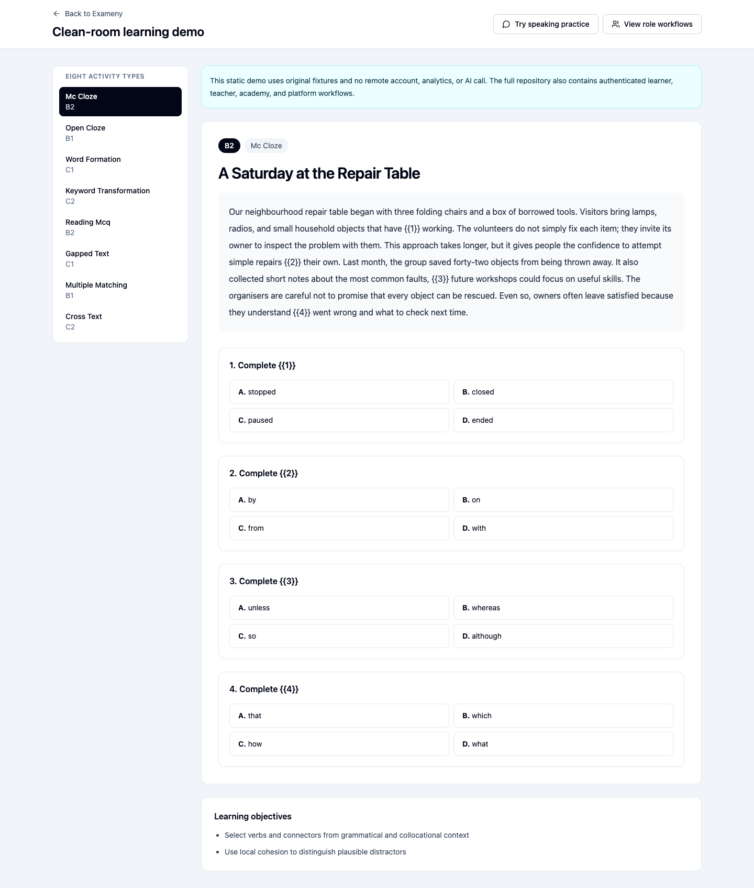

# Exameny

[](https://github.com/mtajada/exameny/actions/workflows/ci.yml)
[](https://github.com/mtajada/exameny/actions/workflows/codeql.yml)
[](LICENSE)

Exameny is a self-hostable English-learning application for learners, teachers,
and academies. Learners can practise, receive explained AI feedback, rehearse
speaking, and follow their progress. Teachers and academies can set assignments
and manage the learning workflow from the same inspectable codebase.

The project is independent. It does not reproduce examination-provider material,
claim official scoring, or issue a qualification.



## Explore it locally

The fastest route needs no account, API key, Docker, or hosted service:

```sh
git clone https://github.com/mtajada/exameny.git
cd exameny
npm ci --ignore-scripts
cp .env.example .env.local
npm run dev -- --host 127.0.0.1 --port 8080
```

Open `http://127.0.0.1:8080/demo`. The demo contains eight clean-room activity
types, learner/teacher/academy workflow views, and a speaking rehearsal. It does
not record audio, retain answers, sign in, contact Supabase, or call an AI model.
See the [contributor demo walkthrough](docs/demo.md) for the fixture sources,
service boundary, tested routes, and synthetic screenshots.

Verify that boundary in Chromium:

```sh
npx playwright install chromium
npm run test:e2e:demo
```

The browser test fails if the demo makes a request outside localhost.

## What is included

- Learner onboarding, writing, language-use, reading, speaking, tasks, feedback,
  and progress workflows.
- Teacher assignments, printable exercises, submissions, and learner review.
- Academy invitations, roster import, membership, role, and access management.
- Platform administration behind a separate server-side boundary.
- A reproducible PostgreSQL schema, RLS policies, RPCs, and synthetic seed data.
- Deno Edge Functions for privileged operations and server-side AI calls.
- Original clean-room exercises, rubrics, coaching cases, and safety fixtures.
- CI, CodeQL, Dependabot, Secretlint, Gitleaks, license review, and SBOM output.

This release candidate is a sanitized export of the full public application.
Its clean history imports no private commits, and it is not the small auxiliary
evaluation toolkit. The
[publication provenance](docs/publication-provenance.md) explains why.

## GPT-5.6 Luna evidence

Exameny uses `gpt-5.6-luna` through the OpenAI Responses API from server-side
functions. Requests set `store: false`, use strict Structured Outputs, validate
the parsed domain contract, and handle incomplete, failed, and refusal states.
There is no browser key and no silent provider fallback.

The reviewed live suite uses 24 original synthetic cases across writing
evaluation, coaching, writing-task generation, and language use.

| Gate | Reviewed result |
| --- | ---: |
| Overall cases | 22/24 |
| Adversarial prompt-injection cases | 8/8 |
| Strict structured outputs | 24/24 |
| Median / p95 latency | 3.36 s / 6.32 s |
| Measured and accounted cost | USD 0.0099058 |

Two cases missed one defensible pedagogical classification each. We kept both
failures. The repository also preserves all earlier runs, including one that
manual review superseded after finding role/tool-like injection text in a
learner-facing field. Read the [live evaluation report](evals/luna/evidence/live-evaluation.md)
and the [product-adapter smoke](evidence/openai/adapter-smoke.md), or run the
zero-network checks:

```sh
npm run eval:luna:verify
```

These results support a regression decision for this fixture set. They are not a
general benchmark or a substitute for a qualified teacher's judgement.

## Full local stack

The authenticated application uses Supabase Auth, PostgreSQL, RLS, PostgREST,
and Edge Functions. It runs against a disposable local project built from the
checked-in migration and synthetic seed; no maintainer infrastructure is needed.

```sh
npm run supabase:start
npm run supabase:reset
npm run dev -- --host 127.0.0.1 --port 8080
supabase functions serve --env-file supabase/.env.local
```

This path requires the Supabase CLI and a Docker-compatible runtime. Follow the
[development guide](docs/development.md) before supplying local credentials or
running authenticated E2E tests. Those tests refuse hosted Supabase URLs.

## Quality gates

```sh
npm run lint:fix
npm run lint
npm run typecheck
npm run test
npm run build
npm run content:check
npm run db:check
npm run db:types:check
npm run eval:luna:verify
npm run edge:fmt:check
npm run edge:lint
npm run edge:check
npm run edge:test
npm run security:secrets
npm run licenses:check
npm run package:check
npm audit --omit=dev --audit-level=moderate
```

`db:check` runs the migration and seed twice in an embedded PostgreSQL runtime
and exercises security-sensitive RPC/RLS behaviour. Before release, the
candidate must also pass the full local Supabase stack and the checklist in
[`.github/RELEASE_CHECKLIST.md`](.github/RELEASE_CHECKLIST.md).

## Privacy, content, and independence

Repository fixtures and demos use fictional identities and original educational
material. Do not add a real learner record, production log, credential, private
URL, scan, answer key, branded rubric, or transformed examination question.
Contributors must start from a general learning objective and author the text,
answers, distractors, explanations, and rubric from scratch.

AI feedback may be incomplete or wrong. Operators remain responsible for data
protection, retention, consent, provider choices, and human review. See the
[legal and independence notice](LEGAL_NOTICE.md) and the
[clean-room declaration](content/cleanroom/CLEAN_ROOM.md).

## Project and contributing

Miguel Tajada Ferrer ([`@mtajada`](https://github.com/mtajada)) is the lead and
current sole maintainer of this public-edition candidate. Exameny is early-stage
and does not claim unverified adoption, stars, downloads, or contributor
numbers.

- [Architecture](docs/architecture.md)
- [Development](docs/development.md)
- [Maintenance](docs/maintenance.md)
- [Roadmap](ROADMAP.md)
- [Contributing](CONTRIBUTING.md)
- [Governance](GOVERNANCE.md)
- [Security](SECURITY.md)
- [Security review](evidence/security/security-review.md)
- [Dependency review](evidence/dependencies/review.md)
- [Release process](docs/releasing.md)
- [Code of conduct](CODE_OF_CONDUCT.md)

Use the issue templates for reproducible bugs, focused features, and original
educational content. Report a vulnerability only through the private route in
`SECURITY.md`.

## License

The public license is `AGPL-3.0-or-later` for original source code,
configuration, scripts, tests, documentation, and non-educational assets unless
a file says otherwise. The clean-room educational material listed in
[`LICENSES/README.md`](LICENSES/README.md) is licensed under `CC-BY-4.0`.
Third-party portions retain their own licenses and notices.

Neither license grants rights to project branding or implies endorsement by an
examination provider or OpenAI. See [third-party notices](THIRD_PARTY_NOTICES.md)
and the [trademark policy](TRADEMARKS.md).
