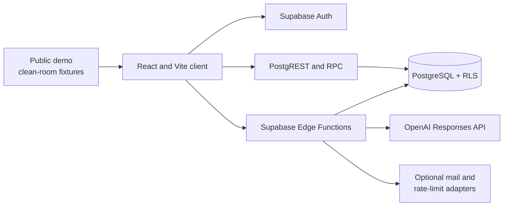

# Architecture

Exameny is a React application with a Supabase backend and server-side AI
functions. The public repository supports two distinct ways to explore it: a
static clean-room demo and the full authenticated local stack.



The demo branch of this diagram is intentionally self-contained. Its browser
test fails on any non-local network request. It demonstrates the learning
activities and learner, teacher, and academy workflows without pretending that
an unauthenticated fixture is a live account.

## Frontend

The client uses React 18, TypeScript, Vite, React Router, TanStack Query, TipTap,
Tailwind CSS, and Radix-based components. It includes:

- onboarding, authentication, profile setup, and protected routes;
- learner writing, language-use, reading, speaking, tasks, feedback, and
  progress views;
- teacher assignment, printable exercise, and learner-detail workflows;
- academy membership and roster administration;
- a separately authorised platform console;
- public clean-room activity and role-workflow demos.

The browser receives only the Supabase URL and publishable key. Client-side
route guards improve navigation but do not replace database or server
authorisation.

## Database, roles, and tenancy

Versioned SQL creates the public schema, grants, row-level policies, functions,
triggers, and synthetic seed data. Academy membership is the tenant boundary.
Learners, teachers, academy administrators, and platform administrators receive
different application routes and database permissions.

Operational outbox, alias-conflict, and role-audit records live in a `private`
schema that is not exposed by the Data API and grants no direct access to client
or service roles. Narrow public RPCs are executable only by `service_role` and
mediate the required writes.

Sensitive mutations run through server-only RPCs or Edge Functions. Every
`SECURITY DEFINER` function pins its `search_path`; privileged functions are not
executable by anonymous users. The database regression test applies migration
and seed twice, then exercises permitted and denied operations in an embedded
PostgreSQL runtime. Full Auth, PostgREST, and Edge integration still uses the
disposable local Supabase stack described in the development guide.

## Edge Functions

Edge Functions enforce request shape, session, academy role, rate limits, and
server-only credentials. They cover AI-assisted learning, invitations, roster
imports, membership administration, and scheduled maintenance. Provider calls
and service credentials never cross into the Vite bundle.

Structured logs may contain request outcome, duration, token counts, model, and
normalised error codes. They must not contain credentials, raw learner text,
provider response IDs, or private HTTP bodies.

## OpenAI boundary

AI workflows use `gpt-5.6-luna` through `POST /v1/responses`. The shared adapter
sets `store: false`, requires strict JSON schemas, validates parsed output, and
handles completed, incomplete, failed, and refusal results explicitly. It has a
bounded timeout and no hidden provider fallback.

The adapter is reused by writing generation and evaluation, language-use and
reading generation, contextual coaching, image-prompt transcription, mistake
realignment, and the quality harness. Domain contracts sit next to each
workflow, while transport and safe observation stay in
`supabase/functions/_shared/openai-responses.ts`.

The independent Luna evaluation suite uses original synthetic cases and records
quality, safety, structured-output rate, latency, token use, cost, failed runs,
and known limitations. See [`evals/luna/evidence/live-evaluation.md`](../evals/luna/evidence/live-evaluation.md).

## Optional providers

Transactional email, distributed rate limiting, analytics, and hosted deployment
are optional adapters. Local development can use the built-in mail catcher and
in-memory safeguards. Analytics defaults to off. A deployment must provide its
own isolated secrets and data services; the repository does not depend on the
maintainer's private Supabase or Vercel projects.

## Data classes

| Data | Repository | Public demo | Operator deployment |
| --- | ---: | ---: | ---: |
| Original synthetic exercises and accounts | Yes | Yes | Yes |
| Real users, submissions, logs, or files | No | No | Access-controlled |
| Browser publishable configuration | Example only | Not required | Environment-managed |
| Service and AI credentials | No | No | Server secret store only |
| AI inputs and outputs | Reviewed fixtures and reports only | No live call | Operator policy applies |

## Repository layout

```text
src/                     React application and public demo
content/cleanroom/       Original educational fixtures and provenance
supabase/migrations/     Reproducible database history
supabase/functions/      Deno server functions and tests
supabase/seed.sql        Synthetic local data
evals/luna/              Reproducible model evaluation and public reports
tests/e2e/               Local-only browser tests
scripts/                 Environment, database, security, and release checks
docs/                    Architecture, development, and release guidance
```

## Deliberate exclusions

The public history contains no production configuration, hosted project link,
private document, user export, or historical secret. Examination-provider
questions, answer keys, brands, and transformed derivatives are outside the
project. Exameny is independent and does not claim official scoring or
certification.
