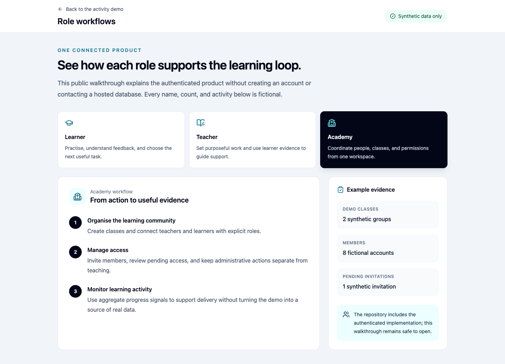
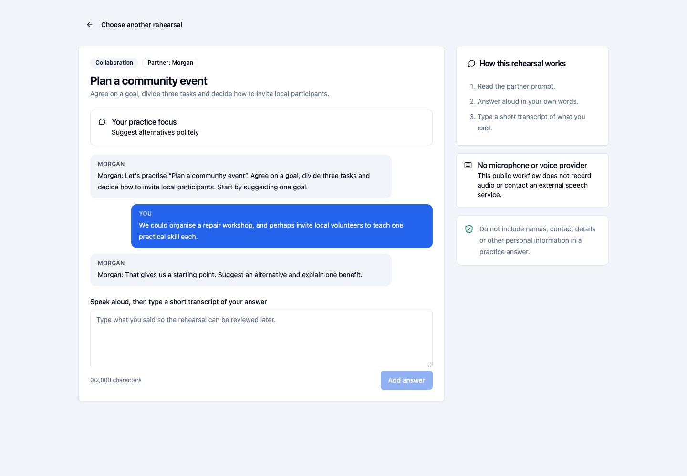

# Public demo walkthrough

Exameny's public demo runs without an account, hosted database, analytics, API
key, or model call. It uses original fixtures and fictional identities.

```sh
npm ci --ignore-scripts
cp .env.example .env.local
npm run dev -- --host 127.0.0.1 --port 8080
```

Open `http://127.0.0.1:8080/demo`.

## Contributor walkthrough

### 1. Inspect an activity

Start at `/demo`. Choose two activity types from the left-hand list, answer one
multiple-choice question, and reveal one sample answer. The eight activities
come from [`content/cleanroom/data/exercises.json`](../content/cleanroom/data/exercises.json),
and [`src/pages/DemoPage.tsx`](../src/pages/DemoPage.tsx) renders them without a
database query.

### 2. Compare the role workflows

Open `/demo/roles` and switch between Learner, Teacher, and Academy. The steps
and example evidence are the fictional `workflows` records defined in
[`src/pages/RoleWorkflowsDemoPage.tsx`](../src/pages/RoleWorkflowsDemoPage.tsx).
They explain the full product's responsibilities; they are not live dashboards,
accounts, assignments, or usage figures.

### 3. Complete a speaking rehearsal

Open `/demo/speaking`, keep the `Plan a community event` scenario, and start the
rehearsal with Morgan. Speak each answer aloud if useful, type three short
answers, then finish the transcript. The scenario and persona come from
[`src/features/speaking/demoCatalog.ts`](../src/features/speaking/demoCatalog.ts).
Prompts are deterministic, no microphone is requested, and the typed transcript
remains in React memory until the page is left or refreshed.

## Static demo and local-service boundary

| Route | Checked-in fixture | What works without services | What the authenticated product adds |
| --- | --- | --- | --- |
| `/demo` | `content/cleanroom/data/exercises.json` | Switch activities, answer questions, reveal explanations | Saved attempts, assignments, feedback, and progress |
| `/demo/roles` | `workflows` in `RoleWorkflowsDemoPage.tsx` | Inspect fictional learner, teacher, and academy journeys | Authenticated dashboards, tenant-scoped records, and role-authorised actions |
| `/demo/speaking` | `DEMO_SPEAKING_PERSONAS` and `DEMO_SPEAKING_SCENARIOS` | Complete a deterministic typed rehearsal in memory | Persist a session and transcript through the local Edge boundary |

The three demo routes never sign in, call Supabase, invoke an AI provider, or
write to storage. To exercise those behaviours, use the disposable local stack
in the [development guide](development.md). It rebuilds PostgreSQL from public
migrations and synthetic seed data; tests reject hosted Supabase URLs.






## Verification record

On 2026-08-26, the three routes were inspected at a 1440-by-1000 viewport with
the Playwright CLI. Activity switching, role tabs, rehearsal setup, and one
synthetic transcript turn worked. The browser reported no warnings or errors,
and no request left localhost.

Repeat the automated boundary check with:

```sh
npx playwright install chromium
npm run test:e2e:demo
```

The test fails if the static demo contacts a non-local origin.

Hashes and the dated browser record are in the
[demo validation evidence](../evidence/demo/VALIDATION.md).

## Maintaining the fixtures

- For an activity, edit `content/cleanroom/data/exercises.json`, keep its
  clean-room provenance, and run `npm run content:check`.
- For a role walkthrough, edit the `workflows` records in
  `RoleWorkflowsDemoPage.tsx`; use only fictional names, counts, and examples.
- For a speaking option, edit `demoCatalog.ts`; do not add a voice provider or
  remote request to demo mode.
- After any demo change, run `npm run test:e2e:demo`. The test covers all three
  routes and fails when the browser contacts a non-local origin.

Screenshots must contain only the checked-in synthetic fixtures. Do not capture
a signed-in account, production service, third-party mark, or real learner text.
